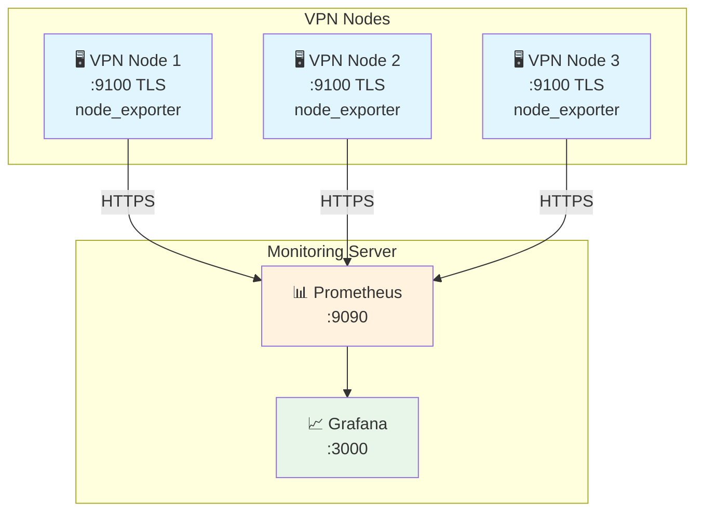

# 📈 Мониторинг: Prometheus + Grafana

Инструкция по настройке мониторинга VPN-нод через Prometheus с TLS-шифрованием и визуализации в Grafana.

## 📋 Содержание

1. [Архитектура](#архитектура)
2. [Установка Node Exporter](#установка-node-exporter)
3. [Настройка TLS-шифрования](#настройка-tls-шифрования)
4. [Firewall на ноде](#firewall-на-ноде)
5. [Настройка Prometheus Server](#настройка-prometheus-server)
6. [Настройка Grafana](#настройка-grafana)
7. [Дашборды](#дашборды)
8. [Алерты](#алерты)
9. [Проверка работоспособности](#проверка-работоспособности)

---

## Архитектура



---

## Установка Node Exporter

Node Exporter собирает метрики Linux-системы (CPU, RAM, диск, сеть) и отдаёт их Prometheus.

### Скачивание и установка

```bash
cd /tmp
wget https://github.com/prometheus/node_exporter/releases/download/v1.10.2/node_exporter-1.10.2.linux-amd64.tar.gz
tar xzf node_exporter-1.10.2.linux-amd64.tar.gz
mv node_exporter-1.10.2.linux-amd64/node_exporter /usr/local/bin/
```

### Создание пользователя

```bash
useradd -rs /bin/false node_exporter
```

### Создание systemd-сервиса (без TLS)

> ⚠️ Этот вариант **без шифрования** — используйте только для тестов или в изолированной сети.

```bash
cat > /etc/systemd/system/node_exporter.service << 'EOF'
[Unit]
Description=Node Exporter
After=network.target

[Service]
User=node_exporter
Group=node_exporter
Type=simple
ExecStart=/usr/local/bin/node_exporter

[Install]
WantedBy=multi-user.target
EOF

systemctl daemon-reload
systemctl enable node_exporter
systemctl start node_exporter
```

### Проверка

```bash
curl http://localhost:9100/metrics | head -20
```

---

## Настройка TLS-шифрования

Для защиты метрик от перехвата рекомендуется настроить TLS.

### Зачем нужно шифрование

- Метрики содержат информацию о сервере (IP, нагрузка, сеть)
- Без TLS данные передаются открытым текстом
- Злоумышленник может перехватить информацию о вашей инфраструктуре

### Создание директории и сертификата

```bash
mkdir -p /etc/node_exporter

# Генерация self-signed сертификата на 10 лет
openssl req -new -newkey rsa:2048 -days 3650 -nodes -x509 \
  -keyout /etc/node_exporter/node_exporter.key \
  -out /etc/node_exporter/node_exporter.crt \
  -subj "/CN=<HOSTNAME>" \
  -addext "subjectAltName = DNS:<HOSTNAME>,IP:<IP_ADDRESS>"
```

**Замените:**
- `<HOSTNAME>` — имя хоста (например: `de1-vpn`)
- `<IP_ADDRESS>` — IP адрес сервера

**Пример:**
```bash
openssl req -new -newkey rsa:2048 -days 3650 -nodes -x509 \
  -keyout /etc/node_exporter/node_exporter.key \
  -out /etc/node_exporter/node_exporter.crt \
  -subj "/CN=de1-vpn" \
  -addext "subjectAltName = DNS:de1-vpn,IP:192.168.1.100"
```

### Конфигурация TLS

```bash
cat > /etc/node_exporter/web-config.yml << 'EOF'
tls_server_config:
  cert_file: /etc/node_exporter/node_exporter.crt
  key_file: /etc/node_exporter/node_exporter.key
EOF
```

### Установка прав

```bash
chown -R node_exporter:node_exporter /etc/node_exporter
chmod 600 /etc/node_exporter/node_exporter.key
```

### Systemd-сервис с TLS

```bash
cat > /etc/systemd/system/node_exporter.service << 'EOF'
[Unit]
Description=Node Exporter
After=network.target

[Service]
User=node_exporter
Group=node_exporter
Type=simple
ExecStart=/usr/local/bin/node_exporter --web.config.file=/etc/node_exporter/web-config.yml

[Install]
WantedBy=multi-user.target
EOF

systemctl daemon-reload
systemctl enable node_exporter
systemctl restart node_exporter
systemctl status node_exporter
```

### Проверка TLS

```bash
curl -k https://localhost:9100/metrics | head -20
```

✅ Если видите метрики — TLS работает.

---

## Firewall на ноде

Разрешите доступ **только с IP Prometheus Server**:

```bash
ufw allow from <IP_PROMETHEUS_SERVER> to any port 9100 proto tcp comment 'Node Exporter'
```

**Пример:**
```bash
ufw allow from 10.10.10.50 to any port 9100 proto tcp comment 'Node Exporter'
```

> ⚠️ **Не открывайте порт 9100 для всех!** Метрики содержат информацию о вашем сервере.

---

## Настройка Prometheus Server

### Docker Compose для Prometheus + Grafana

```bash
mkdir -p /opt/prometheus && cd /opt/prometheus

cat > docker-compose.yml << 'EOF'
services:
  prometheus:
    image: prom/prometheus:latest
    container_name: prometheus
    restart: always
    ports:
      - "9090:9090"
    volumes:
      - ./prometheus.yml:/etc/prometheus/prometheus.yml
      - prometheus_data:/prometheus
    command:
      - '--config.file=/etc/prometheus/prometheus.yml'
      - '--storage.tsdb.path=/prometheus'
      - '--storage.tsdb.retention.time=30d'
      - '--web.enable-lifecycle'

  grafana:
    image: grafana/grafana:latest
    container_name: grafana
    restart: always
    ports:
      - "3000:3000"
    volumes:
      - grafana_data:/var/lib/grafana
    environment:
      - GF_SECURITY_ADMIN_USER=admin
      - GF_SECURITY_ADMIN_PASSWORD=<SECURE_PASSWORD>
      - GF_USERS_ALLOW_SIGN_UP=false

volumes:
  prometheus_data:
  grafana_data:
EOF
```

> ⚠️ Замените `<SECURE_PASSWORD>` на надёжный пароль!

### Конфиг Prometheus (без TLS)

```bash
cat > /opt/prometheus/prometheus.yml << 'EOF'
global:
  scrape_interval: 15s
  evaluation_interval: 15s

scrape_configs:
  - job_name: 'prometheus'
    static_configs:
      - targets: ['localhost:9090']

  - job_name: 'vpn-nodes'
    static_configs:
      - targets:
        - '<NODE_1_IP>:9100'
        - '<NODE_2_IP>:9100'
        - '<NODE_3_IP>:9100'
    relabel_configs:
      - source_labels: [__address__]
        regex: '(.*):\d+'
        target_label: instance
        replacement: '${1}'
EOF
```

### Конфиг Prometheus (с TLS)

Если на нодах настроен TLS:

```bash
cat > /opt/prometheus/prometheus.yml << 'EOF'
global:
  scrape_interval: 15s
  evaluation_interval: 15s

scrape_configs:
  - job_name: 'prometheus'
    static_configs:
      - targets: ['localhost:9090']

  - job_name: 'vpn-nodes'
    scheme: https
    tls_config:
      insecure_skip_verify: true
    static_configs:
      - targets:
        - '<NODE_1_IP>:9100'
        - '<NODE_2_IP>:9100'
        - '<NODE_3_IP>:9100'
        labels:
          type: 'vpn'
    relabel_configs:
      - source_labels: [__address__]
        regex: '(.*):\d+'
        target_label: instance
        replacement: '${1}'
EOF
```

> 💡 `insecure_skip_verify: true` — пропускает проверку сертификата (для self-signed). В продакшене лучше использовать доверенные сертификаты.

### Запуск

```bash
cd /opt/prometheus
docker compose up -d
```

### Проверка

- Prometheus: http://<IP_SERVER>:9090
- Grafana: http://<IP_SERVER>:3000

---

## Настройка Grafana

### Первый вход

1. Откройте http://<IP_SERVER>:3000
2. Логин: `admin`
3. Пароль: указанный в `GF_SECURITY_ADMIN_PASSWORD`

### Добавление Data Source

1. **Configuration** → **Data Sources** → **Add data source**
2. Выберите **Prometheus**
3. URL: `http://prometheus:9090`
4. Нажмите **Save & Test**

---

## Дашборды

### Node Exporter Full (рекомендуется)

1. **Dashboards** → **Import**
2. ID: `1860`
3. Нажмите **Load**
4. Выберите Data Source: Prometheus
5. Нажмите **Import**

### Другие полезные дашборды

| ID | Название | Описание |
|----|----------|----------|
| 1860 | Node Exporter Full | Полный мониторинг Linux |
| 11074 | Node Exporter for Prometheus | Компактный вариант |
| 13659 | Blackbox Exporter | Мониторинг доступности |

---

## Алерты

### Пример правил алертов

Создайте файл `/opt/prometheus/alerts.yml`:

```yaml
groups:
  - name: vpn-nodes
    rules:
      - alert: NodeDown
        expr: up == 0
        for: 1m
        labels:
          severity: critical
        annotations:
          summary: "Node {{ $labels.instance }} is down"
          description: "Node has been down for more than 1 minute"

      - alert: HighCPU
        expr: 100 - (avg by(instance) (irate(node_cpu_seconds_total{mode="idle"}[5m])) * 100) > 80
        for: 5m
        labels:
          severity: warning
        annotations:
          summary: "High CPU usage on {{ $labels.instance }}"
          description: "CPU usage is above 80% for 5 minutes"

      - alert: HighMemory
        expr: (1 - (node_memory_MemAvailable_bytes / node_memory_MemTotal_bytes)) * 100 > 85
        for: 5m
        labels:
          severity: warning
        annotations:
          summary: "High memory usage on {{ $labels.instance }}"
          description: "Memory usage is above 85%"

      - alert: DiskSpaceLow
        expr: (1 - (node_filesystem_avail_bytes{fstype!="tmpfs"} / node_filesystem_size_bytes{fstype!="tmpfs"})) * 100 > 85
        for: 5m
        labels:
          severity: warning
        annotations:
          summary: "Disk space low on {{ $labels.instance }}"
          description: "Disk usage is above 85%"
```

### Обновление prometheus.yml

Добавьте в конфиг:

```yaml
rule_files:
  - 'alerts.yml'
```

### Перезагрузка конфига

```bash
curl -X POST http://localhost:9090/-/reload
```

---

## Проверка работоспособности

### На ноде

```bash
# Статус сервиса
systemctl status node_exporter

# Проверка метрик (без TLS)
curl http://localhost:9100/metrics | head

# Проверка метрик (с TLS)
curl -k https://localhost:9100/metrics | head

# Проверка сертификата
openssl s_client -connect localhost:9100 -tls1_2 </dev/null 2>&1 | grep -E "(Protocol|Cipher)"
```

### На Prometheus Server

```bash
# Проверка targets
curl http://localhost:9090/api/v1/targets | jq '.data.activeTargets[] | {instance: .labels.instance, health: .health}'

# Или в веб-интерфейсе
# http://<IP_SERVER>:9090/targets
```

### В Grafana

1. **Dashboards** → выберите дашборд
2. Проверьте что данные отображаются
3. Если нет данных — проверьте Data Source и targets в Prometheus

---

## 🔧 Быстрая установка Node Exporter с TLS

> ⚠️ Замените `<HOSTNAME>`, `<IP_ADDRESS>` и `<IP_PROMETHEUS_SERVER>` перед выполнением!

```bash
cd /tmp && \
wget https://github.com/prometheus/node_exporter/releases/download/v1.10.2/node_exporter-1.10.2.linux-amd64.tar.gz && \
tar xzf node_exporter-1.10.2.linux-amd64.tar.gz && \
mv node_exporter-1.10.2.linux-amd64/node_exporter /usr/local/bin/ && \
useradd -rs /bin/false node_exporter && \
mkdir -p /etc/node_exporter && \
openssl req -new -newkey rsa:2048 -days 3650 -nodes -x509 \
  -keyout /etc/node_exporter/node_exporter.key \
  -out /etc/node_exporter/node_exporter.crt \
  -subj "/CN=<HOSTNAME>" \
  -addext "subjectAltName = DNS:<HOSTNAME>,IP:<IP_ADDRESS>" && \
cat > /etc/node_exporter/web-config.yml << 'EOF'
tls_server_config:
  cert_file: /etc/node_exporter/node_exporter.crt
  key_file: /etc/node_exporter/node_exporter.key
EOF
chown -R node_exporter:node_exporter /etc/node_exporter && \
chmod 600 /etc/node_exporter/node_exporter.key && \
cat > /etc/systemd/system/node_exporter.service << 'EOF'
[Unit]
Description=Node Exporter
After=network.target

[Service]
User=node_exporter
Group=node_exporter
Type=simple
ExecStart=/usr/local/bin/node_exporter --web.config.file=/etc/node_exporter/web-config.yml

[Install]
WantedBy=multi-user.target
EOF
systemctl daemon-reload && \
systemctl enable node_exporter && \
systemctl start node_exporter && \
ufw allow from <IP_PROMETHEUS_SERVER> to any port 9100 proto tcp comment 'Node Exporter' && \
echo "=== Node Exporter с TLS установлен ===" && \
curl -k https://localhost:9100/metrics | head -5
```

---

## Полезные метрики

| Метрика | Описание |
|---------|----------|
| `up` | Доступность ноды (1 = up, 0 = down) |
| `node_cpu_seconds_total` | Время CPU по режимам |
| `node_memory_MemAvailable_bytes` | Доступная память |
| `node_filesystem_avail_bytes` | Свободное место на диске |
| `node_network_receive_bytes_total` | Входящий трафик |
| `node_network_transmit_bytes_total` | Исходящий трафик |
| `node_load1` | Load average 1 минута |

---

## Полезные PromQL запросы

### CPU Usage %

```promql
100 - (avg by(instance) (irate(node_cpu_seconds_total{mode="idle"}[5m])) * 100)
```

### Memory Usage %

```promql
(1 - (node_memory_MemAvailable_bytes / node_memory_MemTotal_bytes)) * 100
```

### Disk Usage %

```promql
(1 - (node_filesystem_avail_bytes{fstype!="tmpfs"} / node_filesystem_size_bytes{fstype!="tmpfs"})) * 100
```

### Network Traffic (bytes/sec)

```promql
irate(node_network_receive_bytes_total{device="eth0"}[5m])
irate(node_network_transmit_bytes_total{device="eth0"}[5m])
```

---

## Troubleshooting

### Node Exporter не отвечает

```bash
# Проверка сервиса
systemctl status node_exporter
journalctl -u node_exporter -f

# Проверка порта
ss -tlpn | grep 9100

# Тест локально
curl http://localhost:9100/metrics
curl -k https://localhost:9100/metrics
```

### Prometheus не видит ноду

1. Проверьте firewall на ноде: `ufw status`
2. Проверьте URL в prometheus.yml
3. Проверьте статус в Prometheus UI → Status → Targets
4. Если TLS — убедитесь что в конфиге `scheme: https`

### Ошибка TLS

```
TLS error from peer (alert code 47)
```

Проверьте:
1. Сертификат существует: `ls -la /etc/node_exporter/`
2. Права на ключ: `chmod 600 /etc/node_exporter/node_exporter.key`
3. Владелец файлов: `chown -R node_exporter:node_exporter /etc/node_exporter`

### Grafana не показывает данные

1. Проверьте Data Source → Test
2. Проверьте временной диапазон в дашборде
3. Проверьте что Prometheus получает метрики (Targets)

---

[← Zabbix](ZABBIX.md) | [README](README.md) | [VPS.md →](VPS.md)
