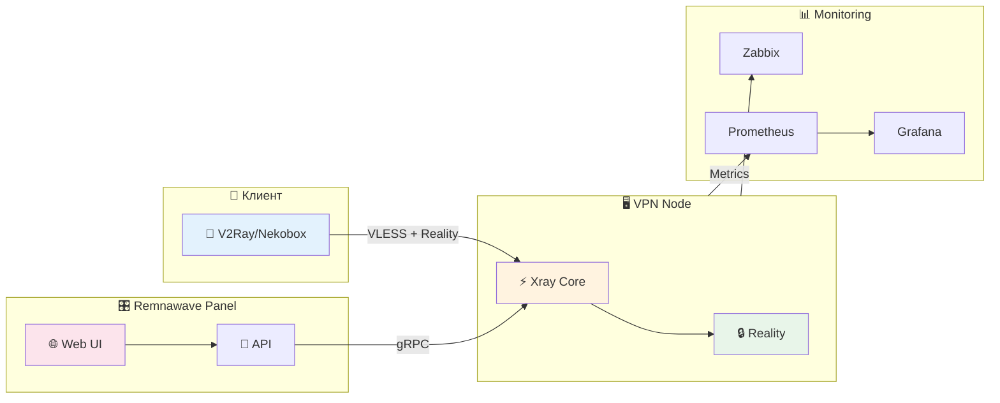

<p align="center">
  
</p>

<h1 align="center">🚀 Remnawave Node Setup Guide</h1>

<p align="center">
  <strong>Полная документация по настройке VPN-нод на базе Remnawave/Xray с VLESS + TCP + Reality</strong>
</p>

<p align="center">
  <a href="#-быстрый-старт">Быстрый старт</a> •
  <a href="#-документация">Документация</a> •
  <a href="#-стек-технологий">Технологии</a> •
  <a href="#-чеклист">Чеклист</a> •
  <a href="#-лицензия">Лицензия</a>
</p>

<p align="center">
  
  
  
  
</p>

<p align="center">
  <a href="https://github.com/wobujidao/remnawave-node-setup/stargazers">
    
  </a>
  <a href="https://github.com/wobujidao/remnawave-node-setup/network/members">
    
  </a>
</p>

---

## 📖 О проекте

Этот репозиторий содержит пошаговые инструкции для развёртывания VPN-нод на базе **Remnawave** с использованием протокола **VLESS + TCP + Reality**. 

Reality — это современная технология маскировки VPN-трафика, которая делает его неотличимым от обычного HTTPS-трафика, что позволяет обходить DPI-блокировки.

### ✨ Особенности

- 🔒 **Максимальная безопасность** — VLESS + Reality с TLS 1.3
- 🚀 **Высокая производительность** — оптимизация сетевых параметров ядра
- 🛡️ **Защита от DPI** — маскировка под легитимные сайты
- 📊 **Мониторинг** — Zabbix и Prometheus с шифрованием
- 🔄 **Автообновления** — Unattended Upgrades + автообновление ноды
- 🔥 **Firewall** — UFW + Fail2ban из коробки

---

## 🛠 Стек технологий

<table>
<tr>
<td align="center" width="96">
  
  <br>Docker
</td>
<td align="center" width="96">
  
  <br>Linux
</td>
<td align="center" width="96">
  
  <br>Ubuntu
</td>
<td align="center" width="96">
  
  <br>Nginx
</td>
<td align="center" width="96">
  
  <br>Prometheus
</td>
<td align="center" width="96">
  
  <br>Grafana
</td>
</tr>
</table>

| Компонент | Технология | Описание |
|-----------|------------|----------|
| **VPN Core** | Xray-core | Ядро прокси с поддержкой VLESS/Reality |
| **Панель управления** | Remnawave | Веб-панель для управления нодами |
| **Контейнеризация** | Docker | Изоляция и простота развёртывания |
| **ОС** | Ubuntu 24.04 LTS | Стабильная серверная ОС |
| **Firewall** | UFW + Fail2ban | Защита от брутфорса и сканирования |
| **DNS** | DNS over TLS | Шифрование DNS-запросов |
| **Мониторинг** | Zabbix / Prometheus | Сбор метрик с шифрованием |
| **Визуализация** | Grafana | Дашборды и алерты |

---

## 📚 Документация

| Документ | Описание | Статус |
|----------|----------|--------|
| [📄 VPS.md](VPS.md) | Полная инструкция по настройке VPN-ноды | ✅ Готово |
| [📊 ZABBIX.md](ZABBIX.md) | Настройка мониторинга Zabbix Agent 2 + PSK | ✅ Готово |
| [📈 PROMETHEUS.md](PROMETHEUS.md) | Настройка Prometheus + Grafana + TLS | ✅ Готово |

---

## 🎯 Быстрый старт

### Требования

| Параметр | Минимум | Рекомендуется |
|----------|---------|---------------|
| **CPU** | 1 vCPU | 2 vCPU |
| **RAM** | 512 MB | 1 GB |
| **Диск** | 10 GB | 20 GB SSD |
| **ОС** | Ubuntu 22.04 | Ubuntu 24.04 LTS |
| **IP** | Чистый IPv4 | IPv4 + IPv6 |

### Установка за 5 минут

```bash
# 1. Скачайте и выполните скрипт подготовки
curl -sSL https://raw.githubusercontent.com/wobujidao/remnawave-node-setup/main/scripts/setup.sh | bash

# 2. Перезагрузите сервер
reboot

# 3. Создайте ноду в панели Remnawave и скопируйте docker-compose.yml

# 4. Запустите ноду
cd /opt/remnanode && docker compose up -d
```

> 📖 Подробная инструкция: [VPS.md](VPS.md)

---

## ✅ Чеклист новой ноды

```
Подготовка сервера
├── [ ] Обновление системы (apt update && upgrade)
├── [ ] Установка Docker
├── [ ] Настройка часового пояса
│
Оптимизация
├── [ ] Сетевые параметры ядра (sysctl)
├── [ ] Лимиты файловых дескрипторов
├── [ ] DNS over TLS
│
Безопасность
├── [ ] UFW (22, 443, NODE_PORT)
├── [ ] Fail2ban
├── [ ] Unattended Upgrades
│
VPN
├── [ ] TLS сканирование (выбор домена)
├── [ ] Remnanode (docker-compose)
├── [ ] Inbound + Host в панели
├── [ ] Автообновление ноды (cron)
│
Мониторинг (опционально)
├── [ ] Zabbix Agent 2 + PSK
└── [ ] Node Exporter + TLS → Prometheus
```

---

## 📊 Архитектура



---

## 🔐 Безопасность

Проект следует лучшим практикам безопасности:

| Функция | Реализация |
|---------|------------|
| **Шифрование трафика** | VLESS + TLS 1.3 + Reality |
| **Шифрование DNS** | DNS over TLS (Cloudflare/Google) |
| **Шифрование мониторинга** | PSK для Zabbix, TLS для Prometheus |
| **Firewall** | UFW с минимальными правилами |
| **Защита от брутфорса** | Fail2ban |
| **Автообновления** | Unattended Upgrades с авторебутом |

---

## 🤝 Благодарности

- [Remnawave](https://github.com/remnawave) — За отличную панель управления
- [XTLS/Xray-core](https://github.com/XTLS/Xray-core) — За ядро прокси
- [RealiTLScanner](https://github.com/XTLS/RealiTLScanner) — За TLS сканер

---

## 📄 Лицензия

Этот проект распространяется под лицензией MIT. Подробности в файле [LICENSE](LICENSE).

---

<p align="center">
  <sub>Если этот проект был вам полезен, поставьте ⭐️</sub>
</p>

<p align="center">
  <a href="https://github.com/wobujidao/remnawave-node-setup/stargazers">
    
  </a>
</p>
